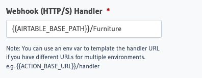
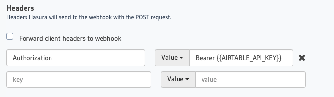

Using this template: https://www.airtable.com/templates/featured/expZvMLT9L6c4yeBX/product-catalog

Map the important parts of your your

Needs authentication: https://airtable.com/account

add auth to env
add base url to auth




https://api.airtable.com/v0/<your_app_id>/Furniture

```graphql
{
  airtable(table: "Furniture") {
    records
  }
}
```

---

# Airtable Action Transform for Hasura

Airtable is a well loved, no-code information manager used by companies of all sizes to perform many different workloads. Leverage Airtable data through Hasura's API ecosystem by using this action transform.

## Getting your Airtable API Settings

You'll need the following environment variables.

```bash
AIRABLE_API_KEY: "keyXXXXXXXXXXXXXX"
AIRTABLE_BASE_PATH: "https://api.airtable.com/v0/<your_app_id>"
```

Locate your API Key in [your Airtable settings](https://airtable.com/account). If no key exists, you make need to generate a new one.  

Your API base path will be available on a per-base basis. [You can find all your Airtable bases here.](https://airtable.com/api)

## Adding Airtable to Hasura

- Create a new action.
- Use

```
https://graphql.contentful.com/content/v1/spaces/<space-id>
```

And replace <space-id> with the appropriate value.

- In Contentful dashboard, click on **Settings**. Under **Space Settings** click on **API keys**. Copy the Space ID and paste in the above endpoint.
- Now copy Content Delivery API - access token and use it in Authorization headers like below:

```
Authorization: Bearer <access_token>
```

- In Hasura Console, head to Remote Schemas and enter GraphQL Server URL with the above contentful endpoint. Under Additional Headers, enter the Authorization header with the access_token as mentioned above.
