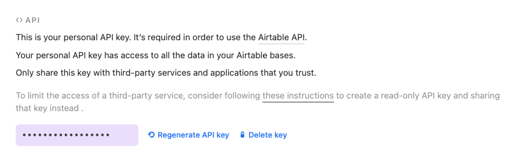

# Airtable Action Transform for Hasura

Airtable is a well loved, no-code information manager used by companies of all sizes to perform many different workloads. Leverage Airtable data through Hasura's API ecosystem by using this action transform.

This integration creates a generic interface with Airtable that requres you to pass the name of your Table within your base as the "table" parameter of the action request.

Using this [E-Commerce example from Airtable](https://www.airtable.com/templates/featured/expZvMLT9L6c4yeBX/product-catalog) you would access the Furniture table the following way.

```graphql
{
  airtable(table: "Furniture") {
    records
  }
}
```

## Getting your Airtable API Settings

You'll need the following environment variables.

```bash
AIRABLE_API_KEY: "keyXXXXXXXXXXXXXX"
AIRTABLE_BASE_PATH: "https://api.airtable.com/v0/<your_app_id>"
```

Locate your API Key in [your Airtable settings](https://airtable.com/account). If no key exists, you make need to generate a new one.  

Your API base path will be available on a per-base basis. [You can find all your Airtable bases here.](https://airtable.com/api)

## Importing an Action Transform

Importing actions and events into Hasura apply one or more actions. Actions based on request configurations and will need metadata to be applied. Events need underlying table structure to trigger the events.

Steps required for this integration:

- Metadata Apply

### Metatadata Apply

To apply metadata into your project. You will need:

1. The Hasura CLI installed.
2. Run "hasura metadata apply" from the root folder of your Hasura metadata project. In this project, you can find that folder under `/hasura`.

More [information about Hasura CLI](https://hasura.io/docs/latest/graphql/core/hasura-cli/index.html) can be found in the documentation.
