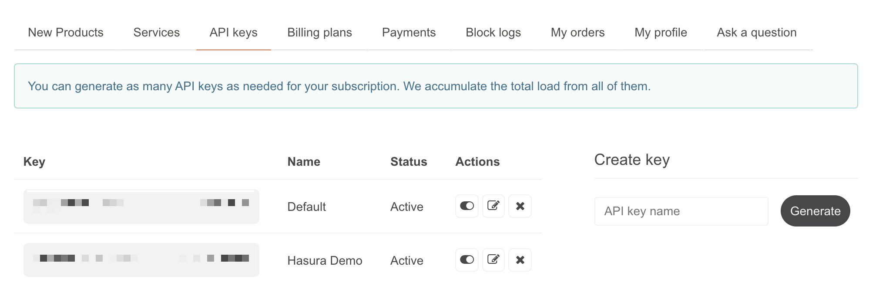
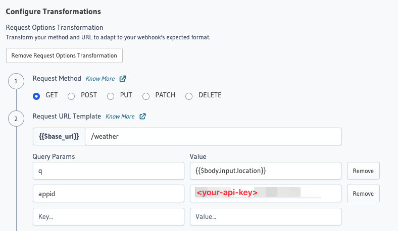

# Openweather Action Transform for Hasura

Openweather is a favorite utility for quickly integrating weather data into applications all around the web. With this integration, you can now use this popular resource without writing a custom endpoint to handle the request!

This integration maps the `/weather` endpoint which takes an input artgument of "location" which can be a city, city/state pair, or postal code. [See the Openweather API documentation for further details.](https://openweathermap.org/current).

An example query:

```graphql
{
  openweather_current(location: "Seattle, Washington") {
    weather
    visibility
    wind
    dt
  }
}
```

## Configuring an Action Transform

You'll need the following environment variables.

```bash
OPEN_WEATHER_API_PATH: "https://api.openweathermap.org/data/2.5"
```

Additionally, you'll need your Openweather API Key which you can find from your [key settings page](https://home.openweathermap.org/api_keys). The Environment variable can be added along with the rest of your Hasura GraphQL Engine settings, but the API key will need to be added as a query parameter value for the action itself.




## Importing an Action Transform

Importing actions and events into Hasura apply one or more actions. Actions based on request configurations and will need metadata to be applied. Events need underlying table structure to trigger the events.

Steps required for this integration:

- Metadata Apply

### Metatadata Apply

To apply metadata into your project. You will need:

1. The Hasura CLI installed.
2. Run "hasura metadata apply" from the root folder of your Hasura metadata project. In this project, you can find that folder under `/hasura`.

More [information about Hasura CLI](https://hasura.io/docs/latest/graphql/core/hasura-cli/index.html) can be found in the documentation.
