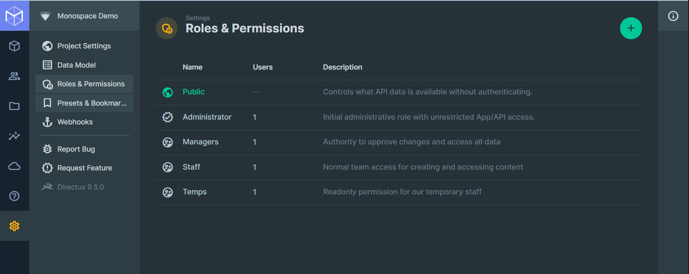
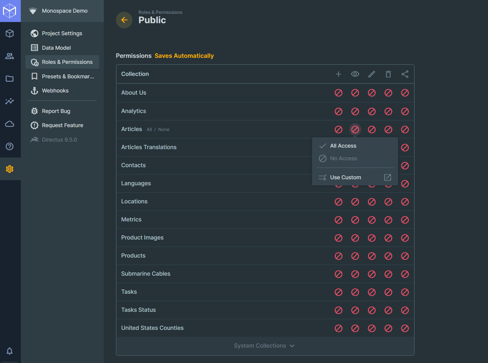
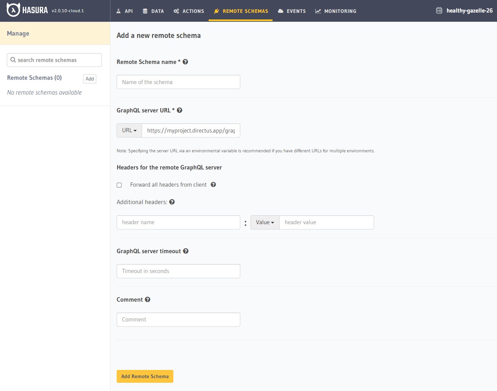
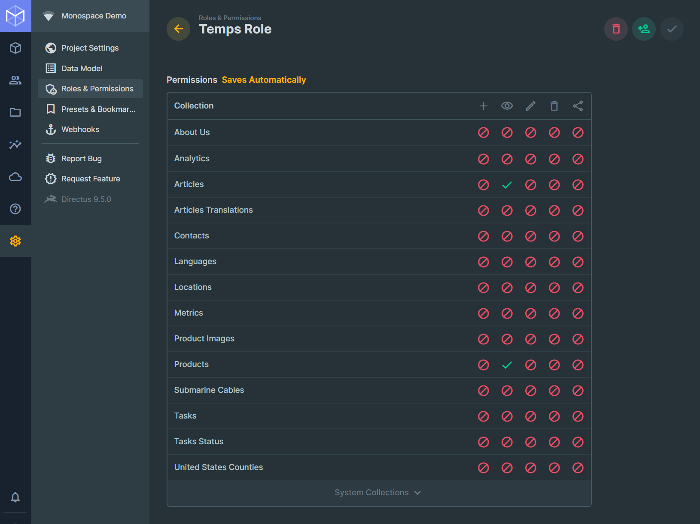
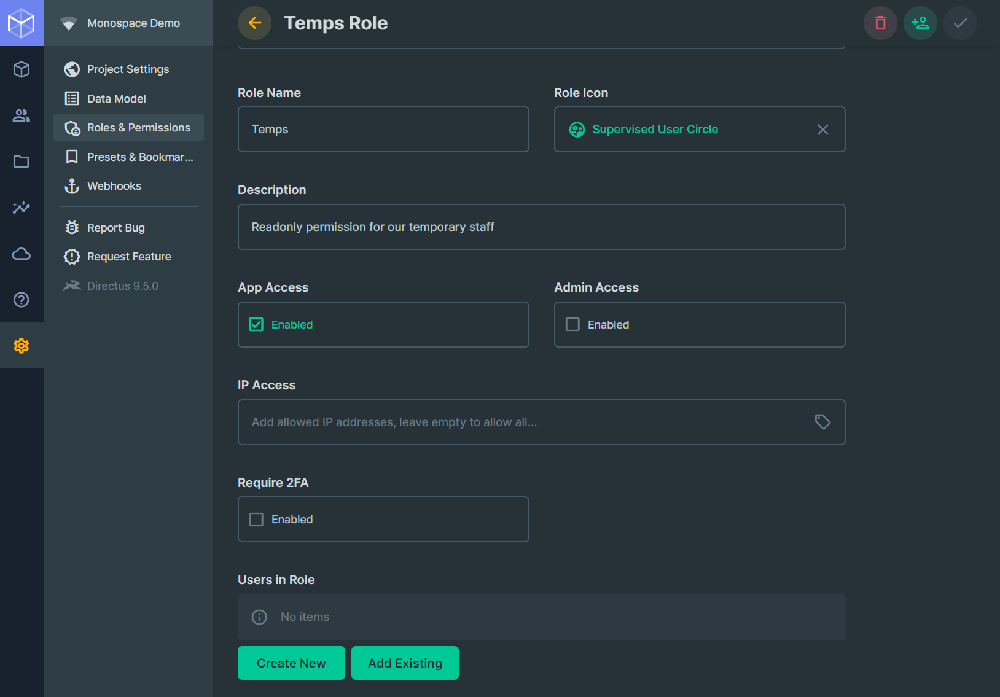
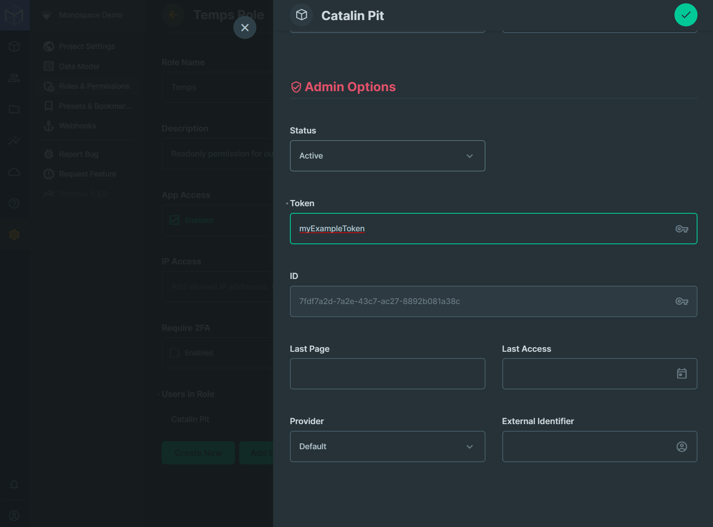
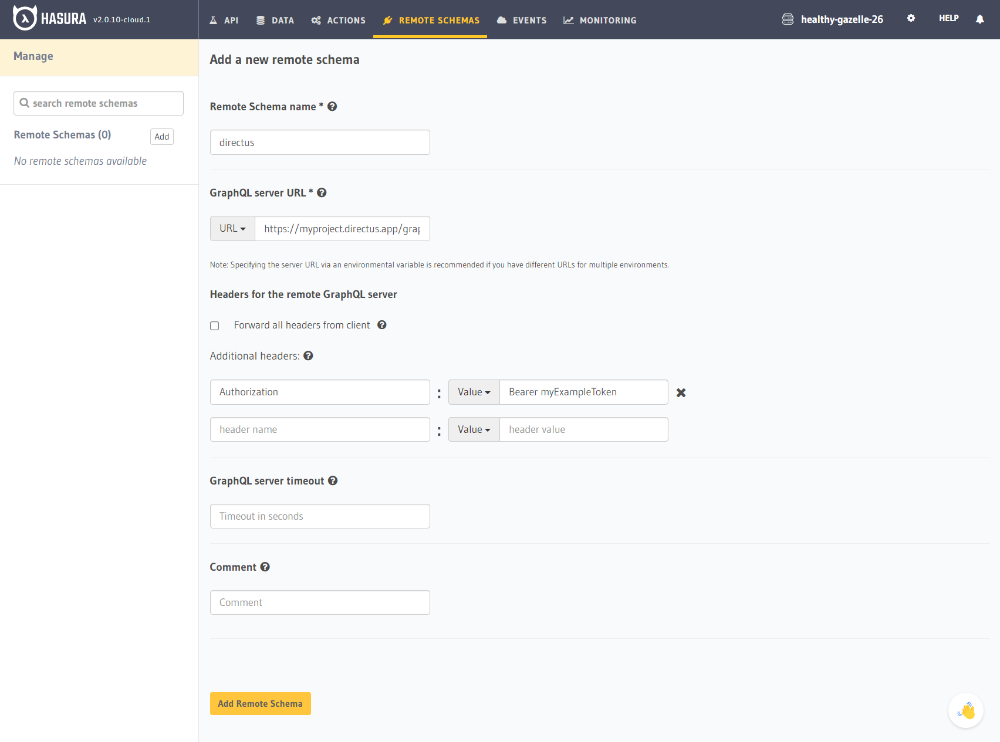

Directus is an open-source Headless CMS with the flexibility and power of a Data API. It allows managing both content and raw data in any new or existing SQL database — keeping all your data pure, organized, and portable, end-to-end.

## Directus GraphQL API

After creating the Directus application, you can access the GraphQL API endpoint as follows:

```
https://<your-project-name>.directus.app/graphql
```

It’s important to note that all data is accessible only to authenticated users. There are two ways to access data:
* using JWTs
* using static tokens that are set for each user and do not expire

Alternatively, you can make your data public and expose it to unauthenticated users.

### Make Data Public

There are scenarios where your data can be made publicly available. If that’s your case, go to the **Roles & Permissions** page in your project’s dashboard.

Once you are there, click on the **Public** role.



A new page opens where you can set the permissions for all your collections. 

Identify your collection and the permission you want to update. At the top, you can see various icons that represent operations such as INSERT, READ, etc.

Click on the red symbol and choose **All Access** for the selected operation. The changes save automatically, so you are done.

**Note**: You can hover over the collection name, and two options will appear where you can instantly make it public (*All*)/private (*None*).



The collection is now publicly available, and you can add Directus as a Remote Schema in Hasura.

## Adding Directus as a Remote Schema

Head over to the Hasura Console, go to the “Remote Schemas” page and click on the “Add” button.

1. Give your Remote Schema a name
2. Add the GraphQL endpoint
3. Click on “Add Remote Schema”



After that, you are done and you can use the GraphQL API in Hasura!

### (Optional) Use Static Tokens

The `Static Tokens` are set for each platform user individually and they do not expire. They are also less secure than JWTs.

Go to the **Roles & Permissions** page in your project’s dashboard and choose a role. For this example, let’s choose the **Temps** role that only gives read-only permissions.


Now select the permissions. All the users assigned the **Temps** role should only see the articles and products. Change the permissions to reflect that.



Now, scroll to the bottom of the page until you see **Users in Role**. Create a new user or add an existing one.



Whether you create a new user or add an existing one, you need to create a token.

Click on the user and add a token, as shown in the image below.



After adding the token, save it!

The last step is to add Directus as a Remote Schema in Hasura. This time, you will use the `Authorization` header as follows:



Replace `myExampleToken` with your token and save it. You are done, and you can use the API in Hasura!

### (Optional) Use Temporary Token (JWT)

A `Temporary Token` is returned by the login endpoint/mutation and has a short expiration time. Since it has a short expiration time, you need to get a new token every once in a while. As a result, it’s more challenging to use a temporary token because you will need to update the Remote Schema with the new token each time.

Check the [documentation](https://docs.directus.io/reference/authentication/) for more information.